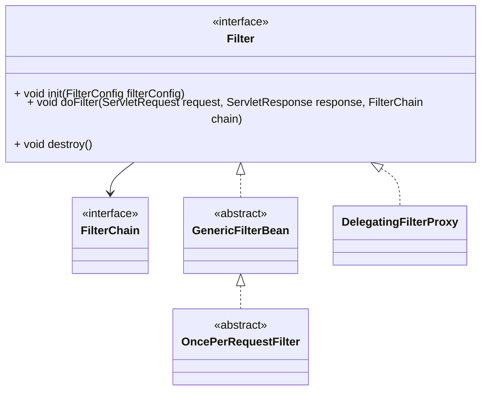
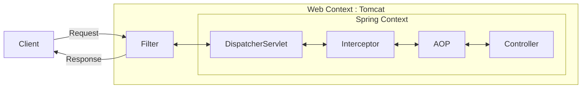

# Filter
- 공통된 보안 및 인증/인가 관련 작업
- 모든 요청에 대한 로깅
- Spring과 분리되어야 하는 기능
- 이미지/데이터 압축 및 문자열 인코딩

```mermaid
classDiagram
    class Filter {
        <<interface>>
        + void init(FilterConfig filterConfig)
        + void doFilter(ServletRequest request, ServletResponse response, FilterChain chain)
        + void destroy()
    }

    class FilterChain {
        <<interface>>
    }

    class GenericFilterBean {
        <<abstract>>
    }

    class OncePerRequestFilter {
        <<abstract>>
    }

    class DelegatingFilterProxy {
    }

    Filter <|.. GenericFilterBean
    GenericFilterBean <|.. OncePerRequestFilter
    Filter <|.. DelegatingFilterProxy
    Filter --> FilterChain
```

# Interceptor
- 세부적인 보안 및 인증/인가 공통 작업
- API 호출에 대한 로깅
- Controller로 넘겨주는 데이터 가공

# 순서 흐름도

```mermaid
graph LR
    A[Client] -->|Request| B[Filter]
    B <--> C[DispatcherServlet]
    C <--> D[Interceptor]
    D <--> E[AOP]
    E <--> F[Controller]
    B -->|Response| A[Client]
    
    subgraph Web Context : Tomcat
        B
    subgraph Spring Context
        C
        D
        E
        F
    end
    end
```
