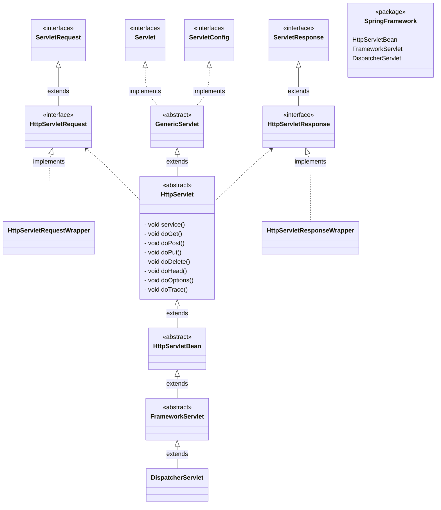

# Servlet
> 클라이언트의 요청을 처리하고, 그 결과를 반환하는 Servlet 클래스의 구현 규칙을 지킨 자바 웹 프로그래밍 기술
- [javax.servlet](https://docs.oracle.com/javaee/7/api/overview-summary.html) 

# Servlet Container
> 서블릿을 관리해주는 컨테이너
- WAS의 web container
- Java는 Apache를 통해 CGI를 적용시키는 것이 불가능함 -> Servlet!
- ex) Tomcat, Jetty, JBoss, WebLogic, WebSphere 등

# JSP (Java Server Pages)
> Java 코드가 들어가있는 HTML 코드
### JSP 동작
1. 웹 서버가 사용자로부터 servlet에 대한 요청 받음
2. servlet container로 요청 전달
3. 요청 받은 container는 Http Request, Http Response 객체 생성
4. servlet doPost(), doGet() 메서드 호출
5. servlet만 사용하여 웹 페이지 보여주려면 out 객체의 println 메소드 사용하여 HTML 문서 작성해야 함. 추가/수정이 어렵고 가독성이 떨어짐. JSP 사용하여 비즈니스 로직과 프레젠테이션 로직 분리.
   - Servlet은 데이터의 입력/수정 등에 대한 제어를 JSP에 넘겨서 프레젠테이선 로직 수행한 후 컨테이너에게 response 전달
6. 결과물은 사용자가 해당 페이지를 요청하면 컴파일 되어 자바파일을 통해 .class 파일이 만들어지고, 두 로직이 결합되어 클래스화 됨

# Dispatcher-Servlet
> Spring MVC에서 클라이언트의 요청을 받아서 처리하는 프론트 컨트롤러

# Servlet Class Diagram

